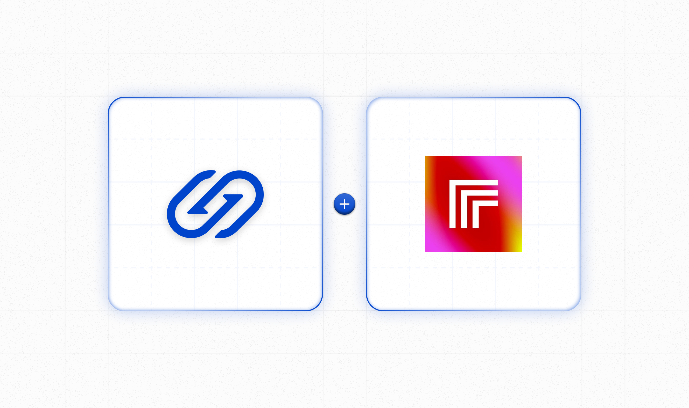
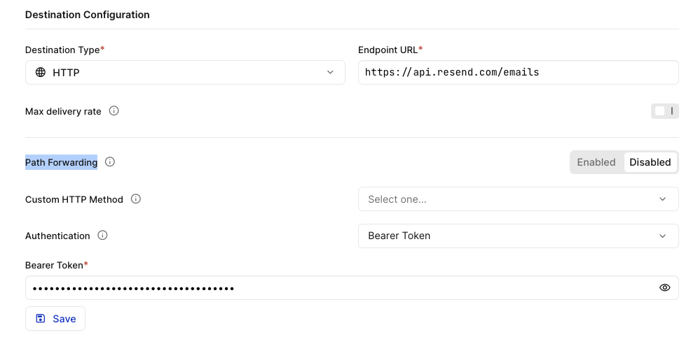

# Hookdeck with Replicate Webhooks Demo



This application is a Node.js application that uses Replicate to run AI models with [Replicate's API](https://replicate.com/docs/get-started/nodejs).

## Before you begin

- Node.js 18 or later. The simplest way to install it is using the installer at [nodejs.org](https://nodejs.org/).
- Install the [Hookdeck CLI](https://github.com/hookdeck/hookdeck-cli):
  ```bash
  npm i -g hookdeck-cli
  ```
- Sign up for a [free Hookdeck account](https://dashboard.hookdeck.com/signup?ref=github-hookdeck-replicate-demo).
- Grab a Replicate API token from [replicate.com/account](https://replicate.com/account) and set it as an environment variable in a `.env` file:
  ```console
  export REPLICATE_API_TOKEN=...
  ```
- Install the application dependencies:
  ```bash
  npm i
  ```

## Run the app

Run the server:

```bash
npm run server
```

Run the Hookdeck CLI:

```bash
hookdeck listen 3030 replicate
```

When prompted, enter `/replicate` as the path.

Run the application to trigger the image generation:

```bash
npm start
```

## Trigger an email with Resend

Create a new connection.

- Name the destination, `resend`.
- Set the URL to `https://api.resend.com/emails`.
- Update the authentication to use **Bearer Token** and set the **Bearer Token** as the Resend API Key.
- Disable **Path Forwarding**



- Add a Transformation to the connection. Save the Transformation and the Connection:

  ```
  addHandler('transform', (request, context) => {
    request.body = {
      from: 'Image Thing <onboarding@resend.dev>',
      to: ['phil@leggetter.co.uk'],
      subject: 'hello world',
      html: `<strong>${request.body.input.prompt}<br />
        </strong>`,
    };

    return request;
  });
  ```

  The Hookdeck Connections should look as follows:


