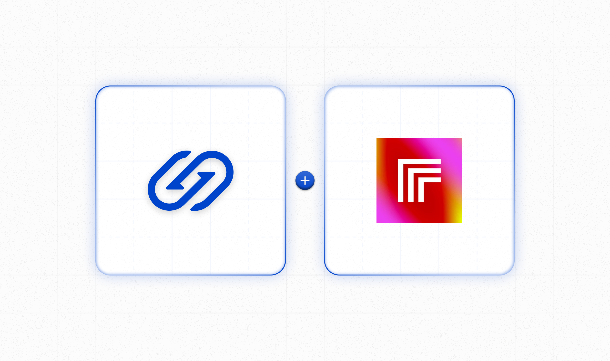
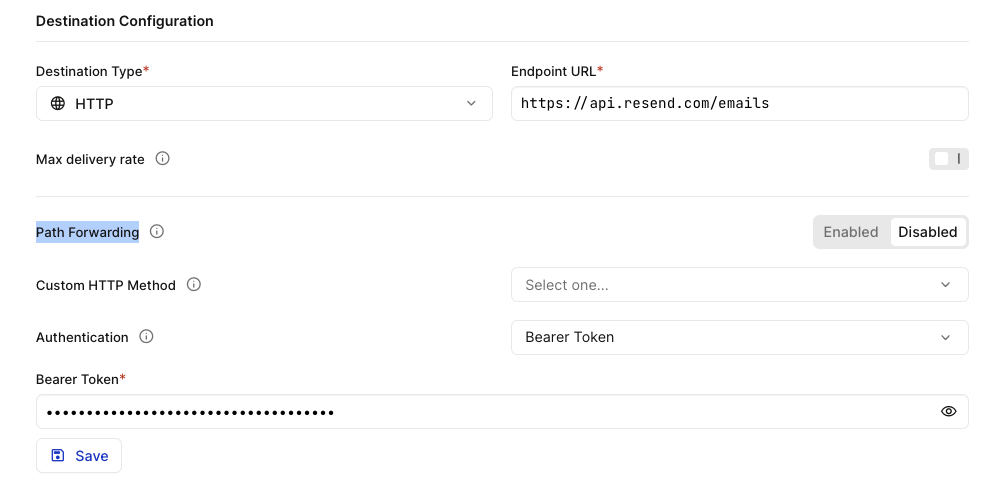
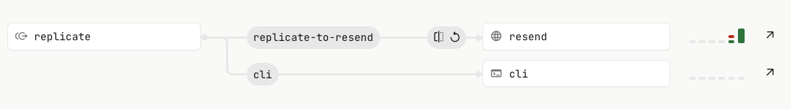

# Hookdeck with Replicate Webhooks Demo



This application is a Node.js application that uses Replicate to run AI models with [Replicate's API](https://replicate.com/docs/get-started/nodejs).

## Before you begin

- Node.js 18 or later. The simplest way to install it is using the installer at [nodejs.org](https://nodejs.org/).
- Install the [Hookdeck CLI](https://github.com/hookdeck/hookdeck-cli):
  ```bash
  npm i -g hookdeck-cli
  ```
- Sign up for a [free Hookdeck account](https://dashboard.hookdeck.com/signup?ref=github-asynchronous-ai-demo).
- Grab a Replicate API token from [replicate.com/account](https://replicate.com/account) and set it as an environment variable in a `.env` file:
  ```console
  REPLICATE_API_TOKEN=...
  ```
- Install the application dependencies:
  ```bash
  npm i
  ```

## Run the app

Run the server:

```bash
npm run server
```

Run the Hookdeck CLI:

```bash
hookdeck listen 3030 replicate
```

When prompted, enter `/replicate` as the path.

The output will be as follows:

```bash
Dashboard
👉 Inspect and replay events: https://dashboard.hookdeck.com?team_id=tm_QkCAfFVqha7n

replicate Source
🔌 Event URL: HOOKDECK_REPLICATE_SOURCE_URL_OUTPUT_HERE

Connections
cli forwarding to /replicate

> Ready! (^C to quit)
```

Add a `HOOKDECK_REPLICATE_SOURCE_URL` to your `.env` file with the value shown **Event URL** output.

```console
HOOKDECK_REPLICATE_SOURCE_URL=...
```

Run the application to trigger the image generation:

```bash
npm start
```

## Trigger an email with Resend

In addition to receiving the result from Replicate on your server, you can also connect to other third-party services. For example, you can trigger an email using [Resend](https://resend.com?ref=github-asynchronous-ai)

Begin by creating a new connection and name the destination `resend`.

Set the URL to `https://api.resend.com/emails`.

Update the authentication to use **Bearer Token** and set the **Bearer Token** as the Resend API Key.



Add a Transformation to the connection. Save the Transformation and the Connection:

```
addHandler('transform', (request, context) => {
  request.body = {
    from: 'Image Thing <onboarding@resend.dev>',
    to: ['YOUR_RESEND_EMAIL'],
    subject: 'hello world',
    html: `<strong>${request.body.input.prompt}<br />
      </strong>`,
  };

  return request;
});
```

Replace `YOUR_RESEND_EMAIL` with the email you signed up for. Or, if you've setup domains with Resend you can use any email address.

The Hookdeck Connections should look as follows:


